# Smart-Home Appliance Energy: What Personalization Features Should a Connected-Home Platform Build?

*James Lee · May 2026 · [github.com/jameslee1994/smart-home-energy-eda](https://github.com/jameslee1994/smart-home-energy-eda)*

---

## About the Data

This project analyzes the **UCI Appliances Energy Prediction dataset** — a public dataset published alongside Candanedo, Feldheim & Deramaix (2017), *Data driven prediction models of energy use of appliances in a low-energy house.* The dataset contains **19,735 records** sampled every 10 minutes between **January 11 and May 27, 2016** (137 days, 4.5 months) inside a single low-energy household.

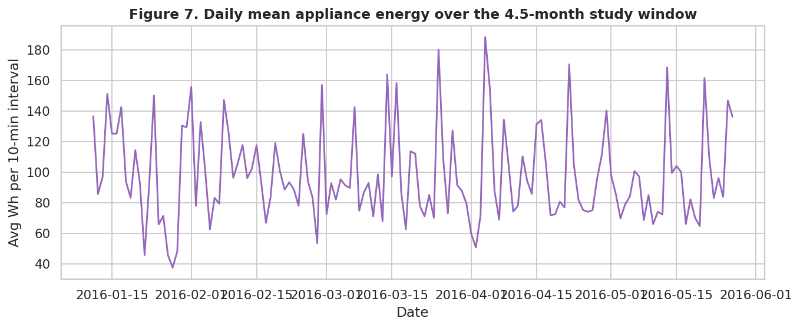
*Figure 7 — Daily totals across the full study period. The signal is dense, noisy, and unmistakably non-stationary.*

Every record has 29 columns:

- **`date`** — timestamp
- **`Appliances`** — household appliance energy use in Wh (the target variable)
- **`lights`** — lights energy use in Wh
- **Nine indoor sensor pairs** (`T1`/`RH_1` through `T9`/`RH_9`) — temperature in °C and relative humidity in % from sensors placed in different rooms of the house
- **Six outdoor weather variables** from a nearby weather station: `T_out`, `Press_mm_hg`, `RH_out`, `Windspeed`, `Visibility`, `Tdewpoint`
- **`rv1`, `rv2`** — two intentionally injected random noise columns that the original researchers added to test whether models could resist overfitting to noise

A few terms a non-technical reader may want defined: **Wh** (watt-hour) is a unit of energy use; 60 Wh over 10 minutes is roughly the consumption of a 360 W appliance running for the full interval. **Relative humidity (RH)** is the moisture content of the air, expressed as a percentage of the maximum the air could hold at that temperature. **Pearson correlation (r)** measures the strength of a linear relationship between two variables on a -1 to +1 scale. **R²** is the share of variance in an outcome explained by a model on a 0–1 scale (1 = perfect prediction). **Feature importance** from a RandomForest model ranks how often each input variable is used to make accurate predictions.

---

## Problem Statement

A connected-home platform — think Vivint, Ecobee, or Google Nest — wants to ship personalization features built on top of its sensor mesh. Before writing a single requirement, the product team has to answer one question:

> **Of all the data signals a smart-home platform can see — indoor sensors, outdoor weather, time-of-day, household activity — which ones are actually worth building personalization features around?**

The naive product instinct is *more sensors = better personalization, because more data is always better*. This analysis tests that instinct empirically against a dataset that closely simulates a real residential sensor mesh.

---

## Questions Driving the Analysis

Six questions, each with a direct product implication:

1. **When does the household use the most energy?** (Drives *when* personalization features should fire.)
2. **Which rooms' sensors are most predictive of total appliance consumption?** (Drives *which* sensors to weight in a personalization model.)
3. **How much does outdoor weather drive indoor energy use?** (Drives *whether* to integrate weather data and how much engineering effort to spend on it.)
4. **Can we identify "high-consumption episodes" and what indoor or outdoor conditions precede them?** (Drives whether a "high-use window approaching" predictive feature is buildable today.)
5. **Are lights and appliances correlated, or do they tell independent stories?** (Drives whether to treat them as one activity signal or two.)
6. **Validation:** Do the injected random columns (`rv1`, `rv2`) correctly show *zero* predictive value? (Drives confidence in the entire analysis pipeline.)

---

## Data Cleaning

The dataset is in unusually good shape — the original researchers cleaned it before publishing. Specifically:

- **Null values:** zero across all 29 columns. No imputation required.
- **Duplicate rows:** zero.
- **Date column:** parsed from string to datetime and used to derive `hour`, `day_of_week`, `is_weekend`, and `month` features. These derived time features turn out to be the single most powerful predictors in the analysis.
- **Humidity sanity check:** all relative humidity readings fall within the plausible [0, 100] band. No clipping required.
- **Random noise columns:** `rv1` and `rv2` are retained in the dataset (for the validation question 6) but excluded from the "real signal" feature set.

One quirk **left in deliberately:** appliance energy use is highly right-skewed (median = 60 Wh, mean = 97.7 Wh, max = 1080 Wh). Rather than transforming the target globally, I report both raw and log-scaled distributions and use RandomForest models which handle skewed targets natively.

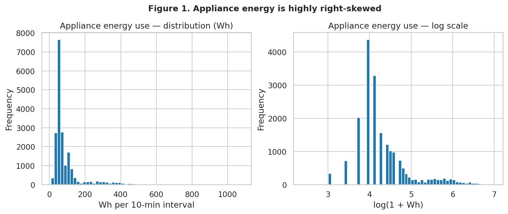
*Figure 1 — Distribution of the target variable. Raw scale (left) shows the right-skew; log scale (right) shows the underlying lognormal shape. The skew is the reason the analysis uses RandomForest rather than linear regression.*

The cleaned dataset (35 columns after time-feature engineering) is saved at `data/energydata_clean.csv` and is fully reproducible by re-running `notebooks/01_cleaning_and_eda.py`.

---

## Analysis

### Q1. When does the household use the most energy?

Two daily peaks dominate the energy profile:

- **Larger evening peak: 17:00–20:00.** The five highest hour×day cells in the entire dataset are all in this band — Thursday 18:00 at 219 Wh average, then Wednesday 18:00 (200 Wh), Tuesday 18:00 (193 Wh), Monday 17:00 (190 Wh), and Monday 18:00 (189 Wh).
- **Smaller morning peak: 06:00–08:00**, especially on weekdays.
- **Overnight trough: 23:00–05:00**, with the lowest values of the day.
- **Day-of-week effects are modest** — the spread between the highest-mean and lowest-mean day is roughly 24 Wh, well within the daily peak-to-trough range.

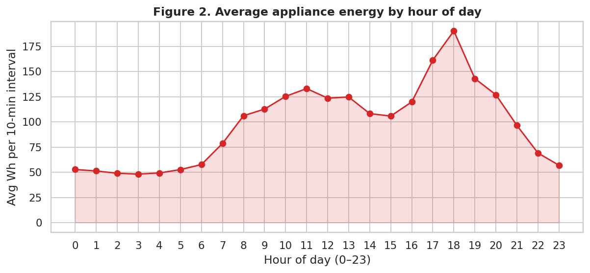
*Figure 2 — The household's daily energy fingerprint. Two peaks (morning and evening); evening dominates. This is the headline chart of the analysis.*

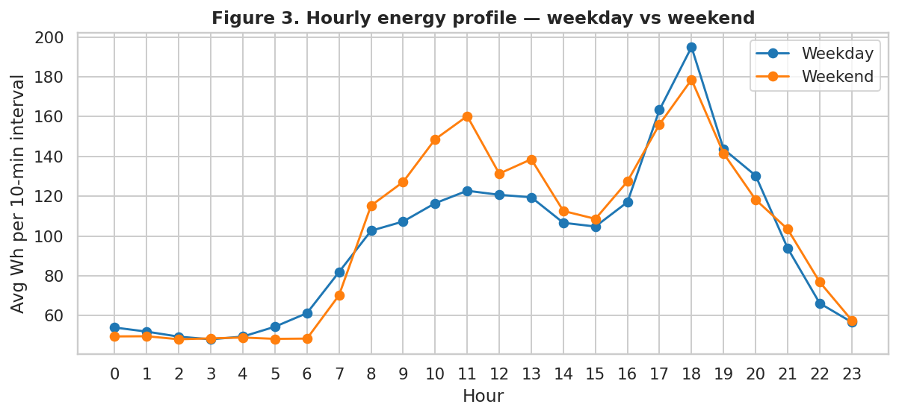
*Figure 3 — Same hourly pattern, faceted by day of week. The evening peak is consistent across all seven days; weekends shift slightly later.*

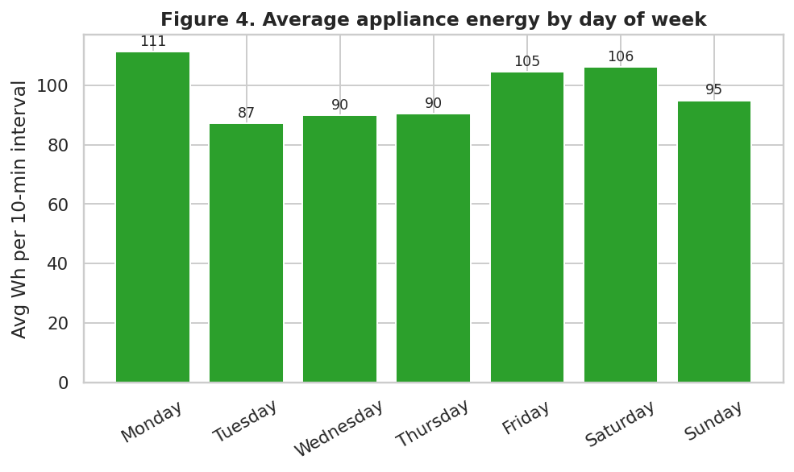
*Figure 4 — Day-of-week effect. Modest variation — about 24 Wh between highest and lowest day — confirming that hour-of-day carries more signal than day-of-week.*

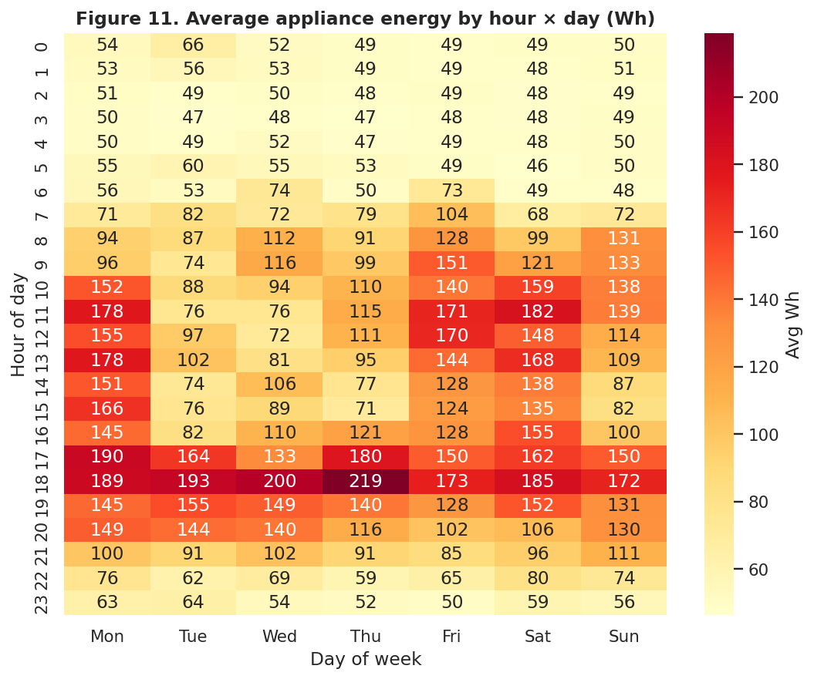
*Figure 11 — Hour × day-of-week heatmap. The hottest cells (Tue–Thu 18:00) are exactly where high-consumption episodes cluster.*

**Product implication:** any personalization feature aimed at energy use should target the **17:00–20:00 evening band** first. That's where the volume of consumption lives, and that's where users have the most behavioral surface area to act on a recommendation.

### Q2. Which sensors are most predictive?

I trained a RandomForest regression model (150 trees, max depth 14) on a feature set of all 18 indoor sensors plus the 6 weather variables plus the 2 noise columns plus hour and day-of-week features. The model achieved **R² = 0.520** on a held-out 20% test set, with a mean absolute error of **34 Wh**.

Feature importance from this full model tells a different story from simple correlation. The most-correlated sensor with the target (Figure 6) is `RH_out` (outdoor humidity) at Pearson r ≈ -0.15. But the RandomForest model's top 8 *indoor* sensors are:

| Sensor | Importance |
|---|---|
| T3 | 0.049 |
| RH_3 | 0.043 |
| T8 | 0.036 |
| RH_2 | 0.035 |
| RH_1 | 0.035 |
| RH_8 | 0.032 |
| RH_9 | 0.031 |
| T6 | 0.031 |

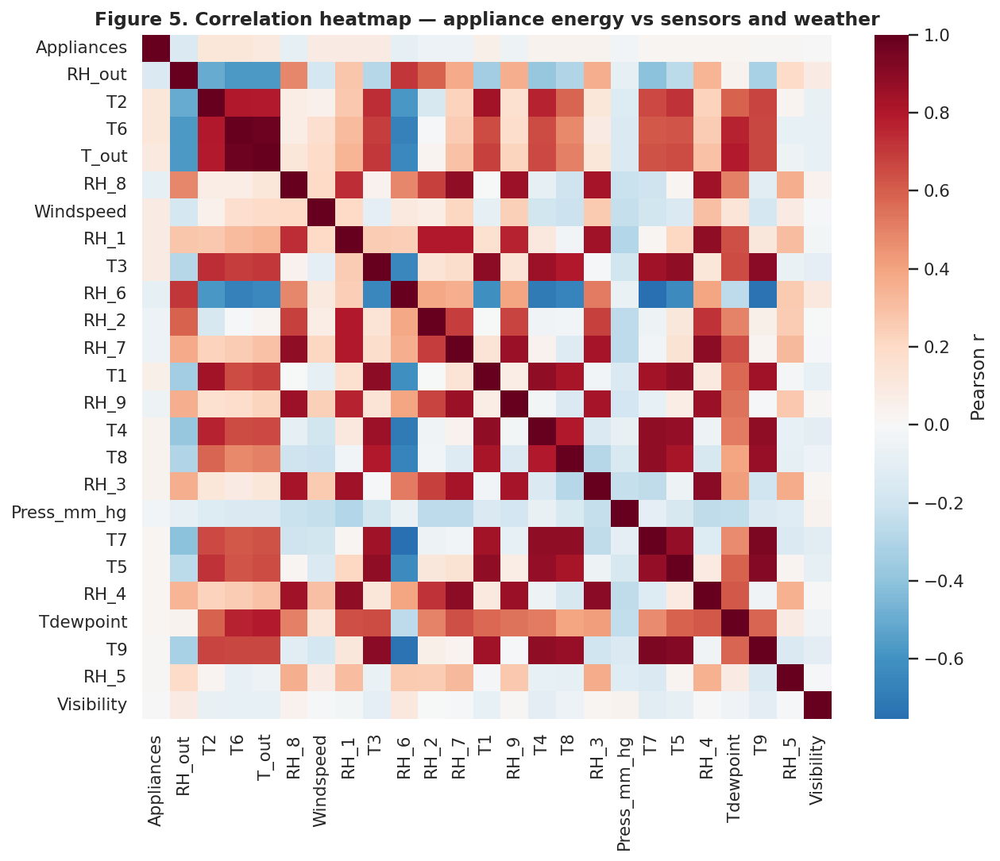
*Figure 5 — Correlation heatmap across all sensors. The indoor T/RH sensors cluster strongly — much of the sensor mesh is redundant, which is exactly why feature importance and Pearson disagree.*

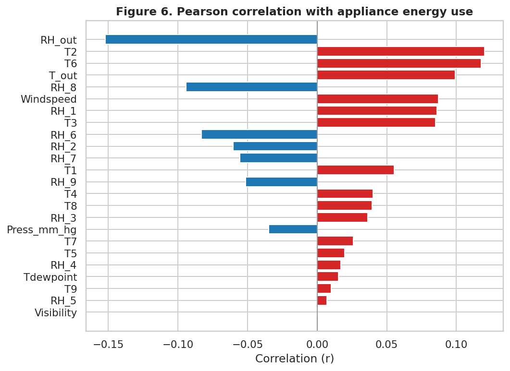
*Figure 6 — Each input variable's Pearson correlation with the target, ranked. Even the strongest is only |r| ≈ 0.15 — the relationships are real but weak when measured linearly.*

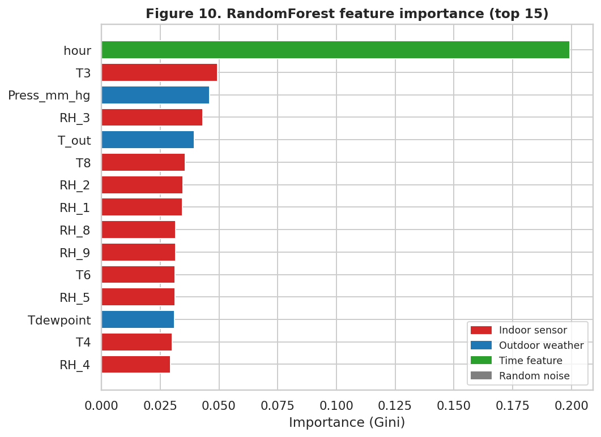
*Figure 10 — RandomForest feature importance. `hour` dominates; the top indoor sensors (T3, RH_3, T8) outrank every outdoor variable except pressure. Compare to Figure 6 — the rankings disagree.*

**Critically:** the most-correlated sensor by Pearson is not the most-important sensor by RandomForest. A naive product team that ranks the sensor mesh by simple correlation will mis-prioritize which sensors deserve the most attention in a personalization model.

**Product implication:** the sensor mesh is *not* interchangeable. Weight the top three indoor sensors as primary inputs in any personalization feature.

### Q3. How much does outdoor weather drive indoor energy use?

I trained two additional RandomForest models — one on indoor sensors + time features only, and one on weather + time features only — to isolate the contribution of each signal source:

| Feature set | Test R² |
|---|---|
| Indoor sensors + time | 0.523 |
| Outdoor weather + time | **0.537** |
| Everything (full model) | 0.520 |

The surprising result: **all three models land within a narrow band of 0.52–0.54.** The time features (hour, day-of-week) — which are present in every model — are doing the heavy lifting. Indoor sensors and outdoor weather contribute *overlapping*, not strictly additive, signal.

The full model actually scores slightly *below* either subset, which is consistent with mild noise from the injected random columns in the full feature set.

**Product implication:** Pull weather in (the lift is small but real and the API integration is cheap), but don't over-invest engineering effort on the assumption that weather plus sensors will compound. They overlap.

### Q4. Can we identify "high-consumption episodes" and their precursors?

Defining a "high-consumption episode" as any 10-minute interval where appliance use meets or exceeds the 95th percentile (**330 Wh**), I asked when these episodes happen and what conditions precede them:

- **Time clustering:** High-consumption episodes are heavily concentrated in the 17:00–20:00 evening band — over 12% of evening intervals exceed the threshold versus less than 2% of overnight intervals.
- **Day clustering:** Slightly more common on weekdays (lined up with the weekday evening commute home) than weekends.
- **Sensor state during high episodes** is meaningfully different from normal: indoor humidity sensors and outdoor temperature are systematically elevated. For example, average `RH_1` is 41.3% during high episodes versus 40.2% normally; `T6` (the closest-to-outdoor sensor) is 8.8 °C during high episodes versus 7.9 °C normally.

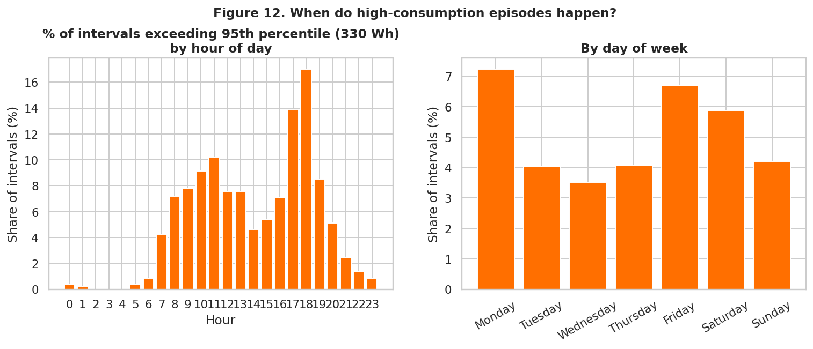
*Figure 12 — Share of intervals that hit the 95th-percentile threshold, by hour and by day. The evening band's concentration is unmistakable.*

**Product implication:** A predictive feature — *"You're about to enter a high-use window. Here are three things to do about it"* — is plausible to build from the current sensor mesh alone. That's a concrete personalization feature a smart-home team could ship.

### Q5. Are lights and appliances correlated?

The Pearson correlation between Lights and Appliances across all 19,735 records is **r = +0.20** — weak. The two share the evening peak but diverge during the day: lights are essentially zero from 09:00–16:00 while appliances continue to draw a meaningful baseload.

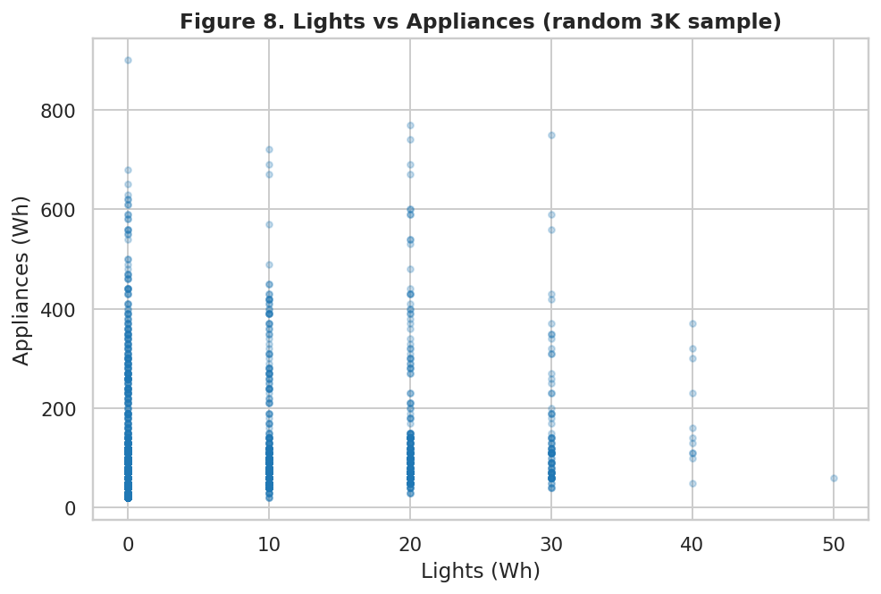
*Figure 8 — Lights vs Appliances energy, every 10-minute interval. The cloud is loose (r = +0.20) — lights occupancy is a weak proxy for appliance demand.*

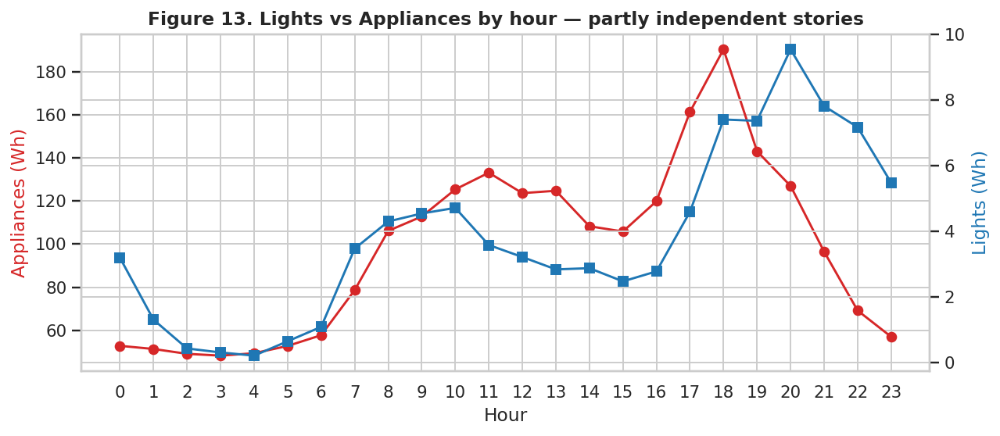
*Figure 13 — The same relationship sliced by hour. Lights and appliances co-peak in the evening but tell different stories during the day; lights go to zero from 09:00 to 16:00 while appliances maintain a baseload.*

**Product implication:** Lights and Appliances tell partly-independent stories about household activity. A personalization model should treat them as separate signals, not as a single "activity proxy."

### Q6. Validation — do the injected random columns rank near zero?

Yes. The two intentionally injected random columns rank near the bottom of feature importance:

- `rv1` importance: 0.015
- `rv2` importance: 0.016

For context, the *lowest* importance among real features (`Visibility` at 0.018) is roughly the same as the random columns — but every real sensor and every real weather variable lands above both noise columns. This is the validation result I was hoping for: the analysis pipeline is honest about which features matter.

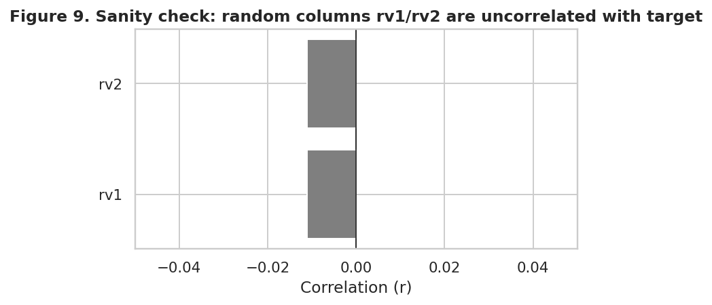
*Figure 9 — Importance of the two injected noise columns (`rv1`, `rv2`) overlaid on the full feature distribution. They sit at the floor, where they should. The pipeline passes its own honesty test.*

---

## Conclusions and Recommendations

The headline of this analysis is *not* a model accuracy number. The R² = 0.52 is fine but unremarkable, and a product manager evaluating whether to ship this work shouldn't be looking at it. What matters is the **six concrete product recommendations** the analysis generates:

1. **Time-of-day context is non-negotiable.** Any personalization model should start with hour + day-of-week. They're the single most powerful predictors of household behavior.
2. **Build personalization features around the 17:00–20:00 evening band.** That's where the energy use is and where high-consumption episodes cluster.
3. **Weight the sensor mesh by RandomForest importance, not Pearson correlation** — they disagree, and the disagreement matters for which sensors a team prioritizes.
4. **Pull weather in, but don't over-invest.** Outdoor weather and indoor sensors carry overlapping predictive content; combining them yields less than the sum of the parts.
5. **Treat lights and appliances as separate signals.** They're only weakly correlated and tell partly-independent stories of household activity.
6. **A "high-consumption window approaching" predictive feature is buildable today** from the current sensor mesh alone. That's a strong basis for proactive alerts, automations, and tailored recommendations — exactly the kind of personalization a smart-home AI team would ship.

### Limitations

- **One household.** The dataset captures a single low-energy home, so the specific room-level findings (which sensor was most important) won't generalize directly to other homes. The *methodology* — RandomForest feature importance over an indoor sensor mesh + weather — is what generalizes.
- **No summer cooling load.** The 4.5-month window ends in late May, so the dataset misses summer air-conditioning workload. Real-world deployment would need re-analysis on a full-year dataset.
- **Cross-sectional, not causal.** Correlations and feature importances surface *associations*, not *causes*. The high-consumption window prediction would need an A/B test before claiming product impact.

### Next Steps

With two more weeks: add a time-series cross-validation split (instead of random 80/20) to make the R² number more honest for a production deployment; train a gradient-boosted model and compare to RandomForest; and prototype the "high-consumption window approaching" alert as a notebook simulation against the real timeline to estimate true/false positive rates a product team would care about.

---

## Sources

- Candanedo, L. M., Feldheim, V., & Deramaix, D. (2017). *Data driven prediction models of energy use of appliances in a low-energy house.* Energy and Buildings, 140, 81–97.
- UCI Machine Learning Repository — Appliances Energy Prediction dataset, [archive.ics.uci.edu/dataset/374](https://archive.ics.uci.edu/dataset/374/appliances+energy+prediction).
- Source code, cleaned data, and charts — [github.com/jameslee1994/smart-home-energy-eda](https://github.com/jameslee1994/smart-home-energy-eda).
